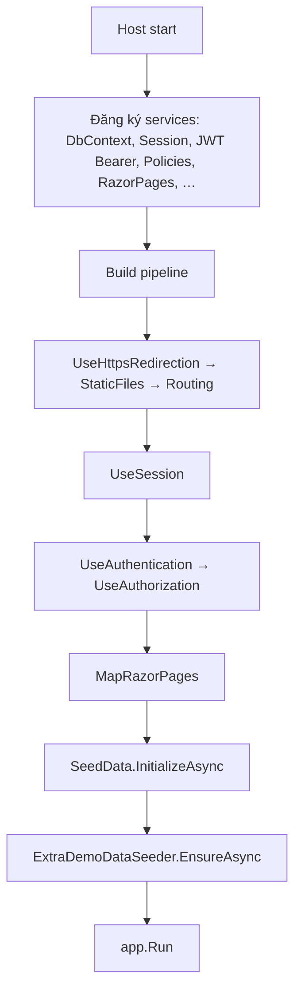
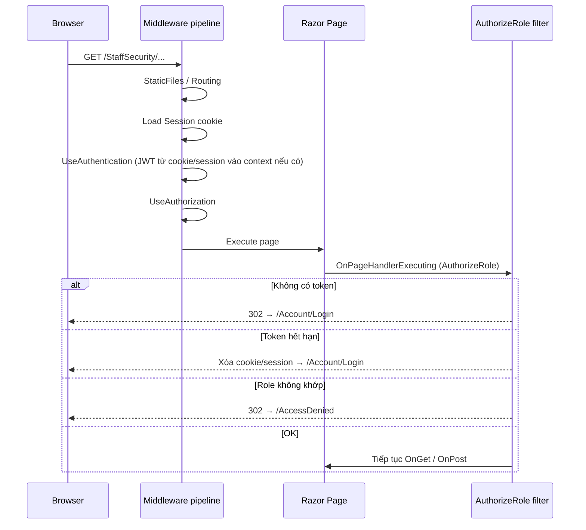

# Group6 — EventPro (PRN222)

Ứng dụng **ASP.NET Core 8 Razor Pages** quản lý sự kiện: Admin, Organizer, Staff (An ninh / Marketing / Hậu cần), người tham dự; xác thực **JWT** (cookie + session).

---

## 1. Yêu cầu môi trường

| Thành phần | Ghi chú |
|------------|---------|
| .NET SDK | 8.0 |
| SQL Server | Local / named instance; **SQL Server Browser** nếu dùng `localhost\INSTANCE` |
| IDE | Visual Studio 2022 hoặc VS Code + C# |

---

## 2. Cấu hình & chạy project

### 2.1 Connection string

Sửa `Group6_PRN222_Project/appsettings.json` → `ConnectionStrings:MyCnn`.

- Instance `MÁY\LOCAL`: trong JSON dùng **`\\`** một lần → một dấu `\` trong chuỗi kết nối, ví dụ `"Server=localhost\\LOCAL;..."`.  
- **`\\\\` trong JSON** → hai `\` liên tiếp trong chuỗi → dễ gây **Instance failure**.

### 2.2 JWT

Bắt buộc `Jwt:Key`, `Jwt:Issuer`, `Jwt:Audience` — thiếu thì `Program.cs` **throw** khi build host.

### 2.3 Chạy

```bash
cd Group6_PRN222_Project
dotnet run --launch-profile http
```

- Profile **http**: `http://localhost:5078`  
- Dừng process đang chạy trước khi Rebuild nếu lỗi copy `.exe`.

---

## 3. Luồng khởi động ứng dụng



| Bước | Chi tiết |
|------|-----------|
| **Session** | `AddDistributedMemoryCache` + `AddSession` (cookie session, timeout 8h, HttpOnly, Essential). **Phải** gọi `UseSession()` **trước** `UseAuthentication()` để middleware sau đọc được `Session` khi xử lý JWT. |
| **JWT Bearer** | `OnMessageReceived`: lấy token từ cookie `auth_token` **hoặc** `Session["auth_token"]` (không bắt buộc header `Authorization`). `OnChallenge`: redirect `/Account/Login?returnUrl=…` (áp dụng cho API/challenge của scheme — khác với `[AuthorizeRole]`). |
| **Policies** | `AdminOnly`, `OrganizerOnly`, `StaffOnly`, `AnyStaff` — dùng khi có `[Authorize(Policy = "…")]`. Nhiều trang nội bộ dùng **`[AuthorizeRole]`** (filter riêng), không nhất thiết dùng policy này. |
| **SeedData** | `EnsureCreatedAsync()`; nếu **`Roles` đã có bản ghi** → `return` ngay, **không** chèn seed ban đầu. |
| **ExtraDemoDataSeeder** | Nếu audit `SEED_EXTRA_DEMO_V1` chưa tồn tại **và** có `Events` → thêm participant `@eventpro.bulk`, tickets, field reports; cuối cùng ghi audit marker. |

---

## 4. Chi tiết: mỗi request HTTP đi qua đâu?



1. **HttpsRedirection** — chuyển HTTP→HTTPS nếu cấu hình.  
2. **StaticFiles** — `wwwroot` (css, js, …).  
3. **Routing** — khớp Razor Page.  
4. **Session** — đọc session id từ cookie, load state server (gồm `auth_token` nếu đã lưu).  
5. **Authentication** — JWT Bearer đọc token như trên; validate theo `TokenValidationParameters`.  
6. **Authorization** — áp dụng `[Authorize]` trên page nếu có.  
7. **Endpoint** — chạy Page Model; **`IPageFilter`** của `[AuthorizeRole]` chạy **trước** handler.

---

## 5. JWT (`JwtService`) — tạo và nội dung token

**Tạo token** (`GenerateToken(User user, string? roleClaimValue = null)`):

- Claims gồm: `NameIdentifier` (UserId), `Name` (username), `FullName`, `Email`, **`Role`** (`ClaimTypes.Role`).  
- Nếu gọi từ **`/Admin/Login`**: truyền **`roleClaimValue`** = role đã qua `InternalRoleResolver` → JWT chứa đúng `Staff(Security)` v.v.  
- Nếu gọi từ **`/Account/Login`**: không truyền → role lấy **`user.Role.RoleName`** thẳng từ DB (thường là `Participant`).

**Thời hạn**: `UtcNow + Jwt:ExpireHours` (mặc định 8h).

**Lưu sau login** (cả hai cổng, pattern giống nhau):

- Response cookie `auth_token` (HttpOnly, SameSite Strict, Secure = theo HTTPS).  
- `Session`: `auth_token`, `username`, `fullname`, `userid`, `role`.

---

## 6. `[AuthorizeRole]` — cơ chế phân quyền trang

File: `Auth/AuthorizeRoleAttribute.cs` — implement **`IPageFilter`**, chạy trong **`OnPageHandlerExecuting`**.

| Bước | Hành động |
|------|-----------|
| 1 | Lấy token = `Request.Cookies["auth_token"]` **hoặc** `Session.GetString("auth_token")`. |
| 2 | Không có token → redirect **`/Account/Login`** + `returnUrl` = path hiện tại. |
| 3 | `JwtSecurityTokenHandler.ReadJwtToken` (decode, **không** validate lại chữ ký ở đây — đã validate ở pipeline nếu dùng scheme). |
| 4 | `ValidTo < UtcNow` → xóa cookie + `Session.Clear()` → redirect login. |
| 5 | Đọc claim role: URI `…/claims/role` hoặc type `role`. |
| 6 | Nếu khai báo `[AuthorizeRole("A","B")]` mà role claim **không** thuộc danh sách → redirect **`/AccessDenied`**. |

**Hệ quả:** Nhân viên nội bộ hết phiên hoặc chưa đăng nhập mà vào trang staff → thường bị đẩy về **`/Account/Login`** (trang khách). Họ cần vào lại **`/Admin/Login`** — đây là điểm cần lưu ý khi hỗ trợ người dùng.

---

## 7. Luồng đăng nhập người tham dự — `/Account/Login`

**Mục đích:** User có role **không** thuộc nhóm nội bộ (ví dụ **Participant**).

1. **POST**: validate model.  
2. Tìm `Users` theo `Username`, `Include(Role)`.  
3. So khớp mật khẩu: **`PasswordHash == Password`** (plaintext).  
4. Nếu `Role.RoleName` thuộc tập **Admin / Organizer / các Staff** → báo lỗi, yêu cầu dùng trang đăng nhập nhân viên.  
5. `GenerateToken(user)` — không override role.  
6. Set cookie + session như mục 5.  
7. Ghi `SystemAuditLogs` action `LOGIN_PARTICIPANT`.  
8. Redirect `ReturnUrl` (nếu local) hoặc `/Index`.

**Register** (nếu có): tạo user gắn role Participant → token tương tự.

---

## 8. Luồng đăng nhập nội bộ — `/Admin/Login`

1. **POST**: validate, tìm user + role.  
2. So khớp mật khẩu giống trên.  
3. **`InternalRoleResolver.TryResolveAppRole(RoleName từ DB, out appRole)`**  
   - Thất bại → thông báo không có quyền nội bộ (kèm tên role DB trong message).  
4. **`GenerateToken(user, appRole)`** — JWT và toàn bộ phân quyền sau này dùng **`appRole`**.  
5. `SetAuthCookieAndSession(..., appRole)` — session `role` = `appRole`.  
6. Audit log `LOGIN_STAFF_…`.  
7. **Redirect mặc định** (nếu không `ReturnUrl`):  
   - `Admin` → `/Admin/DashBoard/AdminDashboard`  
   - `Organizer` → `/Organizer/OrganizerDashboard`  
   - `Staff(Security)` → `/StaffSecurity/Index` (route `/StaffSecurity`)  
   - `Staff(MKT)` / `Staff(Logistics)` → `/Staff/StaffDashboard`

**Chuẩn hóa role** (`Helpers/InternalRoleResolver.cs`): map tên ngắn / alias DB → đúng một trong năm role app (ví dụ `Staff` → `Staff(Security)`). Xem code để biết đầy đủ alias.

---

## 9. Luồng Staff (Security) — từng màn hình

Tất cả dưới đây dùng **`[AuthorizeRole("Staff(Security)")]`** và layout EventPro (`_Layout.cshtml`) + CSS `wwwroot/css/staff-security.css` (một phần).

### 9.1 Hub `/StaffSecurity` (`Index`)

- **GET**: đọc session `fullname`, `userid`.  
- Đếm VIP / blacklist / check-in hôm nay / báo cáo Security / task chưa Done qua EF (giới hạn theo danh sách event từ helper — xem 9.8).  
- Hiển thị tile + nav.

### 9.2 VIP & Blacklist — `VipBlacklist`

- **GET** `eventId` (query): load `Events` qua `StaffSecurityEvents`.  
- Query `Tickets` where `EventId`, join `Participant`, điều kiện `IsVip == true` **hoặc** `IsBlacklisted == true`, sắp xếp hiển thị.

### 9.3 Bản đồ triển khai — `DeploymentMap`

- **GET** `eventId`: load event hiện tại (địa điểm, thời gian).  
- **Tasks** where `AssignedTo == userid` và `EventId` — hiển thị cùng sơ đồ khu vực (UI tĩnh).

### 9.4 Headcount — `Headcount`

- **GET** `eventId`:  
  - **EligibleTickets**: `PaymentStatus == Paid` và `Status` null hoặc `Valid`.  
  - **CheckedIn**: có `CheckInTime`, Paid.  
  - **PendingPayment**: `PaymentStatus == Pending`.  
- Tính % check-in / eligible.

### 9.5 Check-in QR — `CheckIn`

- **GET**: load events qua helper; mặc định chọn event đầu danh sách.  
- **POST**:  
  - Parse GUID từ textarea (trim, regex trong chuỗi URL).  
  - Tìm `Ticket` theo `Qrcode`, optional lọc `EventId`.  
  - **Blacklist** participant → từ chối.  
  - **PaymentStatus** phải `Paid`; **Status** phải `Valid` nếu có.  
  - Đã có `CheckInTime` → báo đã check-in (idempotent).  
  - Ngược lại: gán `CheckInTime = DateTime.Now`, `SaveChanges`, `IAuditLogService.Log`.  
- Trang có script **html5-qrcode** điền GUID vào ô (client).

### 9.6 Báo cáo — `Reports/Index` & `Reports/Create`

- **Index GET**: `FieldReports` where `StaffId == userid` và `ReportType == Security`, mới nhất trước.  
- **Create GET/POST**: chọn event, nhập nội dung; POST tạo bản ghi `ReportType = "Security"`, `ReportTime = now`, audit.

### 9.7 Điều hướng UI

- Partial **`Pages/Shared/_StaffSecurityNav.cshtml`**: `ViewData["StaffSecActive"]` = `index` | `vip` | `map` | `head` | `qr` | `reports` để highlight tab.

### 9.8 Chọn danh sách sự kiện — `StaffSecurityEvents.LoadEventsForStaffAsync`

1. Lấy `EventId` distinct từ `Tasks` where `AssignedTo == userId`.  
2. Nếu có → `Events` thuộc các id đó, order `StartDate`.  
3. Nếu **rỗng** → lấy tối đa 24 event mới nhất (`OrderByDescending StartDate`).  

→ Staff không bị “trắng” dropdown khi chưa được gán task.

---

## 10. Staff dashboard chung & Staff Logistics

### 10.1 `/Staff/StaffDashboard`

- `[AuthorizeRole]` cho cả Security / MKT / Logistics.  
- Đọc session **`userid`**, **`role`**, **`fullname`** (chữ thường — set từ `Admin/Login`).  
- Load task + field reports của user.  
- Nếu `role == Staff(Security)` có banner link sang `/StaffSecurity`.

### 10.2 `Pages/StaffLogistics/*`

- Một nhánh UI dùng **`_StaffLayout.cshtml`** và **`SessionHelper`** với key **`UserID`**, **`Role`**, **`FullName`** (PascalCase).  
- **Debug**: có thể tự gán session nếu chưa login.  
- **Khác biệt** với `Admin/Login`: logistics dev cần đồng bộ session key nếu muốn một phiên cho cả hai — hiện tại là hai convention (lịch sử code).

---

## 11. Chức năng theo từng role (danh mục trong codebase)

**Chung:** Nội bộ đăng nhập **`/Admin/Login`**; JWT + cookie `auth_token` + session (`userid`, `fullname`, `role` chữ thường).  
**Lưu ý bảo mật:** Nhiều trang **Organizer** và **StaffLogistics** không gắn `[AuthorizeRole]` — chỉ dựa vào session/helper hoặc không kiểm tra; URL có thể gõ trực tiếp. Phần dưới mô tả **chức năng thiết kế cho từng vai**, không phải hard guarantee ở tầng attribute.

---

### 11.1 Khách / Participant (role `Participant` hoặc user không thuộc nhóm nội bộ)

| Khu vực | Route / trang | Chức năng |
|---------|----------------|-----------|
| Công khai | `/Index` | Landing EventPro, giới thiệu, CTA. |
| | `/Privacy` | Chính sách / privacy. |
| | `/Events/Index` | Menu/footer trỏ tới **danh sách sự kiện public** — *trong repo có thể chưa có file tương ứng → dễ 404; cần bổ sung Razor Page nếu dùng.* |
| Tài khoản | `/Account/Register` | Đăng ký; gán role Participant (theo logic Register). |
| | `/Account/Login` | Đăng nhập; **chặn** tài khoản Admin/Organizer/Staff. |
| | `/Account/Logout` | Đăng xuất (POST). |
| Sau đăng nhập | Redirect `/Index` hoặc `returnUrl` | JWT chứa role thật từ DB (thường `Participant`). |

---

### 11.2 Admin (`Admin` — sau `InternalRoleResolver`)

**Bảo vệ:** Hầu hết trang quan trọng có **`[AuthorizeRole("Admin")]`**. Một số trang **Operations** thêm kiểm tra `SessionHelper.IsAdmin` (key session **`Role`** = `"Admin"` — **PascalCase `Role`**, khác với `role` từ `Admin/Login`; cần đồng bộ nếu dùng JWT-only).

**Layout:** `_AdminLayout.cshtml` — sidebar như sau:

| Nhóm | Route | Chức năng |
|------|--------|-----------|
| Tổng quan | `/Admin/AdminDashboard` | Dashboard admin (số liệu, điều hướng). |
| Nhân sự & tổ chức | `/Admin/Users/Index` | Danh sách / lọc user; link Create, Edit. |
| | `/Admin/Users/Create`, `Edit` | Tạo / sửa user. |
| | `/Admin/Departments/Index`, `Create`, `Edit` | CRUD phòng ban. |
| Giám sát | `/Admin/AuditLogs/Index` | Nhật ký hệ thống (`SystemAuditLogs`). |
| Báo cáo & KPI | `/Admin/Reports/RevenueReport` | Báo cáo doanh thu. |
| | `/Admin/KPIs/DepartmentKpi` | KPI theo phòng ban. |
| Ngân sách | `/Admin/Budgets/Index` | Danh sách ngân sách / trạng thái duyệt. |
| | `/Admin/Budgets/Detail` | Chi tiết ngân sách. |
| Cấu hình hệ thống | `/Admin/Config/Roles` | Quản lý / xem role. |
| | `/Admin/Config/DiscountPolicies` | Chính sách giảm giá. |
| | `/Admin/Config/Equipment` | Danh mục thiết bị (master). |
| Vận hành (Operations) | `/Admin/Operations/Participants` | Participant toàn hệ thống: tìm kiếm, lọc VIP/blacklist; **bật/tắt VIP & blacklist**; audit. |
| | `/Admin/Operations/SurveyResponses` | Khảo sát / đánh giá theo event, thống kê. |
| | `/Admin/Operations/FieldReports` | Báo cáo thực địa (Security / Logistics / Marketing / …), lọc theo event & loại. |

**Trang login:** `/Admin/Login` (không dùng `[AuthorizeRole]` trên chính trang login).

---

### 11.3 Organizer (`Organizer`)

**Bảo vệ:** Trang **`/Organizer/OrganizerDashboard`** có **`[AuthorizeRole("Organizer")]`**. Các trang con dưới `/Organizer/...` (Events, Tasks, …) **phần lớn không** gắn attribute — trong thực tế nên bổ sung cùng filter hoặc policy.

**Layout:** `Organizer/_Layout.cshtml` — có **chọn context sự kiện** (POST `SetEventContext`) để lọc số liệu theo `Session["SelectedEventId"]`.

| Nhóm | Route (ví dụ) | Chức năng |
|------|-----------------|-----------|
| Dashboard | `/Organizer/OrganizerDashboard` | Dashboard có `[AuthorizeRole]` — landing sau login Organizer. |
| | `/Organizer/Dashboard` | Dashboard số liệu (task, budget, chart) — có thể lọc theo event đã chọn. |
| Sự kiện | `/Organizer/Events/Index` | Danh sách sự kiện. |
| | `Events/Create`, `Edit` | Tạo / sửa sự kiện. |
| | `Events/Timeline` | Timeline sự kiện. |
| Tác vụ | `/Organizer/Tasks/Index`, `Create`, `Edit` | Giao việc cho staff (gán user / deadline / trạng thái). |
| Ngân sách | `/Organizer/Budgets/Index`, `Create` | Ngân sách theo sự kiện; tạo yêu cầu (có thể chờ Admin duyệt). |
| Marketing / giảm giá | `/Organizer/DiscountPolicies/Index`, `Create` | Chính sách giảm giá gắn vận hành sự kiện. |
| Thiết bị sự kiện | `/Organizer/EventEquipments/Index`, `Create`, `Edit`, `Delete` | Gán / quản lý thiết bị theo từng event. |
| Hợp đồng | `/Organizer/Contracts/Index`, `Create`, `Edit`, `Delete` | Quản lý hợp đồng. |
| Nhân sự sự kiện | `/Organizer/Staffs/Index`, `EditRole` | Xem staff / gán role (Security, MKT, Logistics — theo logic trang). |
| Context | `/Organizer/SetEventContext` | Lưu sự kiện đang làm việc vào session (form POST). |

---

### 11.4 Staff (Security) — `Staff(Security)`

Đã mô tả kỹ tại **mục 9**. Tóm tắt route:

| Route | Chức năng |
|-------|-----------|
| `/StaffSecurity` | Hub + thống kê nhanh. |
| `/StaffSecurity/VipBlacklist` | VIP & blacklist theo event. |
| `/StaffSecurity/DeploymentMap` | Bản đồ / khu vực + task của tôi. |
| `/StaffSecurity/Headcount` | Vé Paid / check-in / Pending. |
| `/StaffSecurity/CheckIn` | QR / GUID check-in. |
| `/StaffSecurity/Reports/Index`, `Create` | Báo cáo Security. |
| `/Staff/StaffDashboard` | Task + field reports chung; banner vào module Security. |

**Sau login:** redirect mặc định **`/StaffSecurity`**.

---

### 11.5 Staff (Marketing) — `Staff(MKT)`

| Route | Chức năng |
|-------|-----------|
| `/Staff/StaffDashboard` | **Trang tập trung trong code:** danh sách **task được gán** + **field reports** của user (mọi loại `ReportType` đã gửi). |
| (Không có module `StaffMarketing/*` riêng) | Nghiệp vụ MKT trên hệ thống chủ yếu qua **task Organizer giao** và có thể tham chiếu **Marketing campaigns** trong DB (seed); không có CRUD campaign riêng cho role MKT trong `Pages/`. |

**Sau login:** redirect **`/Staff/StaffDashboard`**.

---

### 11.6 Staff (Logistics) — `Staff(Logistics)`

| Route | Chức năng |
|-------|-----------|
| `/Staff/StaffDashboard` | Giống MKT: task + báo cáo của tôi. |
| `/StaffLogistics/Index` | Dashboard logistics (đếm task theo trạng thái, báo cáo gần đây). |
| `/StaffLogistics/Tasks/Index` | Danh sách task được gán. |
| `/StaffLogistics/Equipment/Index` | Xem / thao tác thiết bị (theo logic trang). |
| `/StaffLogistics/Reports/Index` | Danh sách báo cáo thực địa của user. |
| `/StaffLogistics/Reports/Create` | Tạo báo cáo loại **Logistics / Equipment / Issue**. |

**Session:** nhánh Logistics dùng **`SessionHelper`** (`UserID`, `Role`, `FullName` — PascalCase). Phiên đăng nhập từ **`/Admin/Login`** lưu `userid` chữ thường — **có thể không khớp** với code DEBUG tự gán session trong `StaffLogistics`; cần thống nhất key nếu dùng một luồng đăng nhập.

**Sau login:** redirect **`/Staff/StaffDashboard`**.

---

### 11.7 Bảng tổng hợp redirect sau `/Admin/Login`

| `appRole` (JWT / session) | Redirect mặc định |
|---------------------------|-------------------|
| `Admin` | `/Admin/DashBoard/AdminDashboard` |
| `Organizer` | `/Organizer/OrganizerDashboard` |
| `Staff(Security)` | `/StaffSecurity/Index` (`/StaffSecurity`) |
| `Staff(MKT)` | `/Staff/StaffDashboard` |
| `Staff(Logistics)` | `/Staff/StaffDashboard` |

---

### 11.8 Policy trong `Program.cs` (dùng khi có `[Authorize(Policy=…)]`)

| Policy | Role được phép |
|--------|----------------|
| `AdminOnly` | `Admin` |
| `OrganizerOnly` | `Organizer` |
| `StaffOnly` | `Staff(Security)`, `Staff(MKT)`, `Staff(Logistics)` |
| `AnyStaff` | Admin, Organizer + cả ba loại Staff |

Nhiều Razor Page hiện dùng **`[AuthorizeRole]`** thay vì policy — hai cơ chế song song.

---

## 12. Dữ liệu mẫu (chi tiết điều kiện)

| Nguồn | Điều kiện chạy | Ghi chú |
|--------|----------------|---------|
| **SeedData** | `Roles` **không** có bản ghi | Một lần cho DB mới; gồm users mẫu (`admin` / `Admin@123`, …), events, tickets, … |
| **ExtraDemoDataSeeder** | Chưa có log `SEED_EXTRA_DEMO_V1` **và** có ít nhất 1 `Event` | Thêm ~45 participant `*@eventpro.bulk`, nhiều ticket, vài `FieldReport` Security nếu tìm được user an ninh |

**Chạy lại bulk:** xóa dòng `SystemAuditLogs` với `Action = 'SEED_EXTRA_DEMO_V1'`; tránh trùng email nếu đã insert bulk trước đó (xóa participant bulk hoặc đổi marker version trong code).

---

## 13. Sự cố thường gặp

| Hiện tượng | Nguyên nhân / xử lý |
|-------------|---------------------|
| VS: không kết nối web server **http** | App crash khi start (SQL/JWT/seed); xem Output. |
| **Instance failure** | Connection string / SQL chưa chạy. |
| **MSB3021** | Tắt `Group6_PRN222_Project.exe` đang chạy. |
| Staff login OK nhưng vào trang Security bị về **Account/Login** | `[AuthorizeRole]` redirect mặc định tới đó; dùng lại `/Admin/Login` hoặc chỉnh filter redirect sang `/Admin/Login` cho staff. |
| Hai workspace (OneDrive + D:\\) | Xung đột static web assets — chỉ mở một bản copy project. |

---

## 14. Cấu trúc thư mục (tham chiếu)

```
Group6_PRN222_Project/
├── Pages/
│   ├── Account/          # Login/Register participant
│   ├── Admin/            # Login nội bộ + quản trị
│   ├── Organizer/
│   ├── Staff/
│   ├── StaffSecurity/
│   └── StaffLogistics/
├── Data/                 # SeedData, ExtraDemoDataSeeder
├── Auth/                 # JwtService, AuthorizeRoleAttribute
├── Helpers/              # InternalRoleResolver, StaffSecurityEvents
├── Services/
└── Models/
```

---

*Tài liệu phản ánh codebase tại thời điểm cập nhật; sau khi đổi route, filter hoặc session key, nên sửa README cho khớp.*
